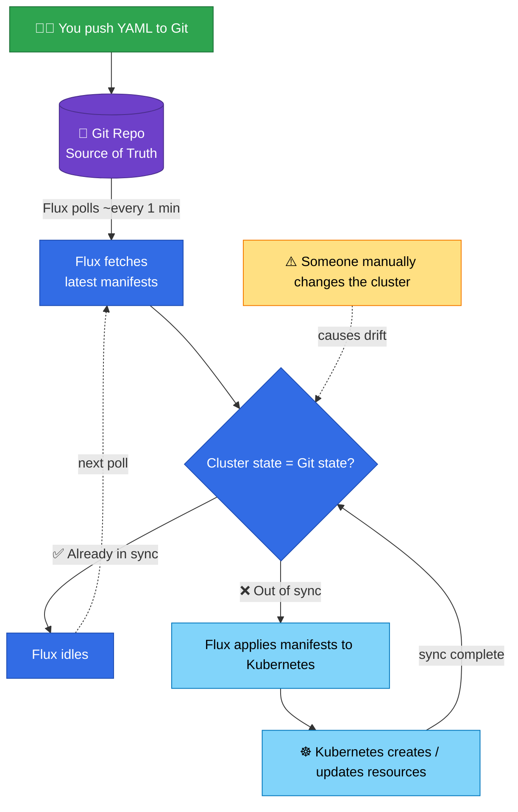

```bash
    __   ____          ___             __                 __                     ___   __  _
   / /__( __ )_____   / _/  ____ _____/ /   _____  ____  / /___  __________     /  /  / /_(_)___ ___  ___
  / //_/ __  / ___/  / /   / __ `/ __  / | / / _ \/ __ \/ __/ / / / ___/ _ \    / /  / __/ / __ `__ \/ _ \
 / ,< / /_/ (__  )  / /   / /_/ / /_/ /| |/ /  __/ / / / /_/ /_/ / /  /  __/   / /  / /_/ / / / / / /  __/
/_/|_|\____/____/  / /    \__,_/\__,_/ |___/\___/_/ /_/\__/\__,_/_/   \___/  _/ /   \__/_/_/ /_/ /_/\___/
                  /__/                                                      /__/
```

<div align="center">

[](https://discord.gg/home-operations)&nbsp;&nbsp;
[](https://talos.dev)&nbsp;&nbsp;
[](https://kubernetes.io)&nbsp;&nbsp;
[](https://fluxcd.io)&nbsp;&nbsp;

</div>

<div align="center">

[](https://github.com/kashalls/kromgo)&nbsp;&nbsp;
[](https://github.com/kashalls/kromgo)&nbsp;&nbsp;
[](https://github.com/kashalls/kromgo)&nbsp;&nbsp;
[](https://github.com/kashalls/kromgo)&nbsp;&nbsp;
[](https://github.com/kashalls/kromgo)&nbsp;&nbsp;
[](https://github.com/kashalls/kromgo)&nbsp;&nbsp;

</div>

---
##  Welcome

Welcome to the (Kubernetes) Humble Home Lab repo. The source of truth for my bare metal cluster running on Talos Linux.

The goal here is to deepen my understanding of k8s, become the GitOps mindset, and share what I learn along the way.

---
##  Hardware

| System                   | Role           | CPU   | RAM   | Graphics | Disk (boot) | Disk (storage) |
|--------------------------|----------------|-------|-------|----------|-------------|----------------|
| (3x) HP EliteDesk 800 G3 Mini | Control Plane  | Intel i5-6500T     | 16GB DDR4| Intel HD 530 |256GB SSD   | —              |
| (3x) HP EliteDesk 800 G3 Mini | Worker         | Intel i5-6500T     | 64GB DDR4  | Intel HD 530 |512GB SSD   | 1TB NVMe       |
| Custom Server  | AI Workloads + NAS | Intel i7-6700K     | 64GB DDR4 |  RTX3090 |256GB SSD | 50TB RaidZ2 Pool (4x 28TB Disks) |

All of this is connected to a [Ubiquiti](https://ui.com) network with VLANS configured for IoT, Management, DMZ, and Cameras.

---
##  Talos Linux

[Talos](https://www.talos.dev) is an immutable, API driven operating system designed specifically for Kubernetes. Talos is configured declaritively and is a great choice for a GitOps driven workflow.

---
##  Kubernetes

For me, a home lab about tinkering and learning. So I set off to learn [Kubernetes](https://kubernetes.io) with a goal to grow my skillset and have an infrastructure that allows me to scale and provide useful, locally hosted applications for my family.

---
##  Networking: Cilium

Networking in my cluster is handled by [Cilium](https://cilium.io/).

I'm using [Envoy Gateway](https://gateway.envoyproxy.io) to manage application traffic coming into the cluster.

---
##  Observability Stack

To keep a pulse on the cluster, I'm using: [Prometheus](https://prometheus.io), [Grafana](https://grafana.com), [VictoriaLogs](https://victoriametrics.com/products/victorialogs/), [Alertmanager](https://github.com/prometheus/alertmanager), [Gatus](https://github.com/TwiN/gatus), and [Fluentbit](https://fluentbit.io).

---
##  Storage: Rook + Ceph

Persistent storage is provided by [Rook-Ceph](https://rook.io/), utilizing the 1TB NVMe drives on each worker.

---
##  GitOps with Flux

The backbone of this cluster is [Flux CD](https://fluxcd.io/) — a GitOps controller that reconciles my entire Kubernetes state from a Git repository.

My ultimate goal is to have Flux and [Renovate](https://www.mend.io/renovate/) handle most of the deployments and updates to the cluster.

### How does it work?

The core idea: **Git is the single source of truth**. Flux continuously compares what's in Git against what's running in the cluster, and corrects any difference — whether that's a new commit you pushed, or a "drift" caused by a manual change someone made directly on the cluster.

<details>
  <summary>See Flux in action</summary>



> **The magic of GitOps:** if someone manually tweaks a resource directly on the cluster, Flux detects the drift and reverts it back to what Git says it should be. The cluster always converges to Git — not the other way around.

</details>

---
I made a [Youtube video](https://youtu.be/aeUKOpeoiUs) that gives a general overview of my configuration and the core components.

<a href="https://youtube.com/watch?v=aeUKOpeoiUs">
  
</a>

---
##  Foundation: onedr0p's Cluster Template

Special thanks to the most excellent [onedr0p/cluster-template](https://github.com/onedr0p/cluster-template). It provides a clean, modern foundation for Talos + Flux-based clusters — and taught me how to organize manifests properly, use SOPS, and implement GitOps the right way.

[](https://github.com/onedr0p/cluster-template)
[](https://github.com/onedr0p/cluster-template)


---
##  Start This Journey Today
If you're interested in this type of thing, I encourage you to build your own home lab. It doesn't have to be Kubernetes. Grab ANY old computer and see what you can deploy on it.

Embrace the process. It will be infuriating at times, blissful at others.

You'll build some really cool stuff along the way. And your brain waves will expand.

---
##  Stargazers

<a href="https://star-history.com/#gavinmcfall/home-ops&Date">
  <picture>
    <source media="(prefers-color-scheme: dark)" srcset="https://api.star-history.com/svg?repos=chr1sd/home-ops&type=Date&theme=dark" />
    <source media="(prefers-color-scheme: light)" srcset="https://api.star-history.com/svg?repos=chr1sd/home-ops&type=Date" />
    
  </picture>
</a>